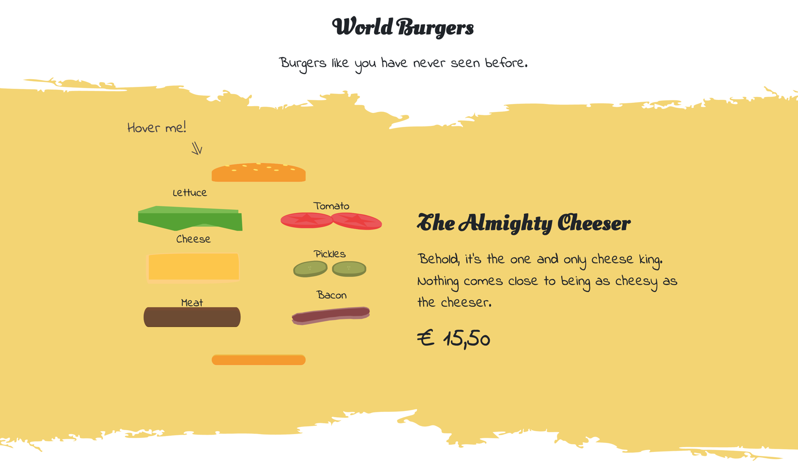

<h1 align="center">CSS to the Rescue @cmda-minor-web 18-19</h1>

<p align="center"><b>A restaurant hamburger menu that's created with only HTML and CSS.</b></p>

<br>

<p align="center">
  <a href="https://mennauu.github.io/css-to-the-rescue-1819/week1/">
    
  </a>
  &nbsp;&nbsp;&nbsp;
  <a href="https://mennauu.github.io/css-to-the-rescue-1819/week2/">
    
  </a>
  &nbsp;&nbsp;&nbsp;
  <a href="https://mennauu.github.io/css-to-the-rescue-1819/week3/">
    
  </a>
  &nbsp;&nbsp;&nbsp;
  <a href="https://github.com/Mennauu/web-app-from-scratch-18-19/blob/master/LICENSE">
    
  </a>
</p> 

<br>



<br>

<!-- ☝️ replace this description with a description of your own work -->
## Introduction
This Hamburger restaurant menu is made as part of a course from [@cmda-minor-web 18-19](https://github.com/cmda-minor-web/css-to-the-rescue-1819). In this course I had to make a menu without any JavaScript. The idea was to write as much Vanilla HTML and CSS as possible. The end product is a menu full of animations, transitions and keyframe effects.

<!-- Maybe a table of contents here? 📚 -->
## Table of Contents

- [Installation](#installation)
- [Features](#features)
- [Data](#data)
  - [Retrieve](#retrieve)
  - [Featured data](#featured-data)
- [Checklist](#checklist)
- [Credits](#credits)
- [Sources](#sources)
  - [API](#api)
  - [Router](#router)
  - [Async and await](#async-and-await)
  - [General JavaScript](#general-javascript)
- [License](#license)

<!-- How about a section that describes how to install this project? 🤓 -->
## Installation
1. Open your terminal
2. Change the directory to a folder in which you want to place the files
```bash
cd /~path
```
3. Clone the repository (you're going to need [Git](https://www.linode.com/docs/development/version-control/how-to-install-git-on-linux-mac-and-windows/))
```bash
git clone https://github.com/Mennauu/css-to-the-rescue-1819.git
```
4. Load any [live server](https://www.npmjs.com/package/live-server) and serve index.html

<!-- ...but how does one use this project? What are its features 🤔 -->
## Features
The site is mostly visual but includes a hover effect on one of the burgers, and a click effect on a different burger.

<!-- Maybe a checklist of done stuff and stuff still on your wishlist? ✅ -->
## Checklist
- [x] Create a concept
- [x] Make a burger using only HTML and CSS
- [x] Add hover effect to burger
- [X] Make the burger responsive (without media queries)
- [X] Create more burger sections
- [X] Add creative names and descriptions to burgers
- [X] Make everything responsive (without media queries)
- [X] Add unique styling to every burger section
- [ ] Think of more creative styling 
- [X] Write a README

<!-- Maybe someone helped me 🤔-->
## Credits
**Folkert**: For explaining vmin and vmax, so the hamburger borders wouldn't be huge on mobile.

<!-- Maybe I used some awesome sources that I can mention 🤔-->
## Sources
Underneath you will find some awesome sources that were used to create this product.

### Svg
- 🎇: [Fire animation](https://codepen.io/tahina/pen/WRXNwQ)
- 🎇: [Asteroid animation](https://loading.io/pattern/dust)
- 🎇: [Red pepper](https://codepen.io/tahina/pen/WRXNwQ)

### Tools
- 🛠: [Clip path maker](https://bennettfeely.com/clippy/)

### Documentation
- 📖: [Aspect ratio boxes](https://css-tricks.com/aspect-ratio-boxes/)

<!-- How about a license here? 📜 (or is it a licence?) 🤷 -->
## License 
See the [LICENSE file](https://github.com/Mennauu/web-app-from-scratch-18-19/blob/master/LICENSE) for license rights and limitations (MIT).